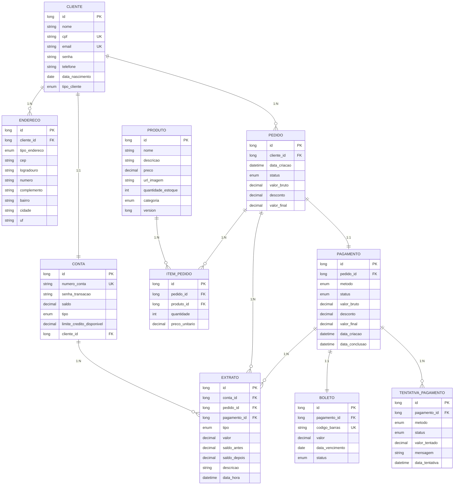

# Diagrama Entidade-Relacionamento (ER)

## Diagrama Visual



## Tabelas e Relacionamentos

### **CLIENTE**
- **Descrição**: Dados dos clientes do sistema
- **Chave Primária**: `id` (IDENTITY)
- **Chaves Únicas**: `cpf`, `email`
- **Relacionamentos**:
  - 1:1 com `CONTA` (um cliente tem uma conta bancária)
  - 1:N com `ENDERECO` (um cliente pode ter múltiplos endereços)
  - 1:N com `PEDIDO` (um cliente pode fazer múltiplos pedidos)

### **CONTA**
- **Descrição**: Contas bancárias dos clientes
- **Chave Primária**: `id` (IDENTITY)
- **Chaves Únicas**: `numero_conta`
- **Chaves Estrangeiras**: `cliente_id` (referencia CLIENTE)
- **Relacionamentos**:
  - 1:1 com `CLIENTE`
  - 1:N com `EXTRATO` (uma conta pode ter múltiplos extratos)

### **ENDERECO**
- **Descrição**: Endereços dos clientes
- **Chave Primária**: `id` (IDENTITY)
- **Chaves Estrangeiras**: `cliente_id` (referencia CLIENTE)
- **Relacionamentos**:
  - N:1 com `CLIENTE`

### **PRODUTO**
- **Descrição**: Catálogo de produtos disponíveis
- **Chave Primária**: `id` (IDENTITY)
- **Relacionamentos**:
  - 1:N com `ITEM_PEDIDO` (um produto pode estar em múltiplos itens de pedido)

### **PEDIDO**
- **Descrição**: Pedidos realizados pelos clientes
- **Chave Primária**: `id` (IDENTITY)
- **Chaves Estrangeiras**: `cliente_id` (referencia CLIENTE)
- **Relacionamentos**:
  - N:1 com `CLIENTE`
  - 1:N com `ITEM_PEDIDO` (um pedido pode ter múltiplos itens)
  - 1:1 com `PAGAMENTO` (um pedido tem um pagamento)
  - 1:N com `EXTRATO`

### **ITEM_PEDIDO**
- **Descrição**: Itens individuais de um pedido
- **Chave Primária**: `id` (IDENTITY)
- **Chaves Estrangeiras**: `pedido_id`, `produto_id`
- **Relacionamentos**:
  - N:1 com `PEDIDO`
  - N:1 com `PRODUTO`

### **PAGAMENTO**
- **Descrição**: Informações de pagamento dos pedidos
- **Chave Primária**: `id` (IDENTITY)
- **Chaves Estrangeiras**: `pedido_id` (referencia PEDIDO)
- **Relacionamentos**:
  - 1:1 com `PEDIDO`
  - 1:1 com `BOLETO` (um pagamento pode ter um boleto)
  - 1:N com `TENTATIVA_PAGAMENTO`
  - 1:N com `EXTRATO`

### **TENTATIVA_PAGAMENTO**
- **Descrição**: Registro de tentativas de pagamento
- **Chave Primária**: `id` (IDENTITY)
- **Chaves Estrangeiras**: `pagamento_id` (referencia PAGAMENTO)
- **Relacionamentos**:
  - N:1 com `PAGAMENTO`

### **BOLETO**
- **Descrição**: Dados de boleto bancário para pagamento
- **Chave Primária**: `id` (IDENTITY)
- **Chaves Únicas**: `codigo_barras`
- **Chaves Estrangeiras**: `pagamento_id` (referencia PAGAMENTO)
- **Relacionamentos**:
  - 1:1 com `PAGAMENTO`

### **EXTRATO**
- **Descrição**: Registro de transações financeiras
- **Chave Primária**: `id` (IDENTITY)
- **Chaves Estrangeiras**: `conta_id`, `pedido_id`, `pagamento_id`
- **Relacionamentos**:
  - N:1 com `CONTA`
  - N:1 com `PEDIDO` (opcional)
  - N:1 com `PAGAMENTO` (opcional)

## Enumeradores (Enums)

### **TipoCliente**
- `ROLE_USER`: Usuário comum
- `ROLE_ADMIN`: Administrador
- `ROLE_MODERATOR`: Moderador

### **TipoConta**
- `CORRENTE`: Conta corrente
- `POUPANCA`: Conta poupança
- `INVESTIMENTO`: Conta de investimento

### **TipoEndereco**
- `RESIDENCIAL`: Endereço residencial
- `COMERCIAL`: Endereço comercial
- `CORRESPONDENCIA`: Endereço de correspondência

### **Categoria**
- `ELETRONICOS`: Eletrônicos
- `VESTUARIO`: Vestuário
- `ALIMENTOS`: Alimentos
- `OUTROS`: Outros

### **StatusPedido**
- `PENDENTE`: Pedido aguardando processamento
- `CONFIRMADO`: Pedido confirmado
- `ENVIADO`: Pedido enviado
- `ENTREGUE`: Pedido entregue
- `CANCELADO`: Pedido cancelado

### **StatusPagamento**
- `PENDENTE`: Pagamento aguardando processamento
- `APROVADO`: Pagamento aprovado
- `RECUSADO`: Pagamento recusado
- `CANCELADO`: Pagamento cancelado

### **StatusBoleto**
- `PENDENTE`: Boleto não pago
- `PAGO`: Boleto pago
- `CANCELADO`: Boleto cancelado

### **MetodoPagamento**
- `BOLETO`: Pagamento via boleto bancário
- `CARTAO_CREDITO`: Pagamento com cartão de crédito
- `CARTAO_DEBITO`: Pagamento com cartão de débito
- `TRANSFERENCIA`: Pagamento por transferência bancária
- `PIX`: Pagamento via PIX

### **TipoExtrato**
- `DEPOSITO`: Depósito realizado
- `SAQUE`: Saque realizado
- `PAGAMENTO_PEDIDO`: Pagamento de pedido
- `REEMBOLSO`: Reembolso recebido
- `JUROS`: Juros cobrados
- `TARIFA`: Tarifa bancária

## Índices Recomendados

```sql
-- Índices para melhor performance

-- CLIENTE
CREATE INDEX idx_cliente_cpf ON cliente(cpf);
CREATE INDEX idx_cliente_email ON cliente(email);

-- CONTA
CREATE INDEX idx_conta_cliente_id ON conta(cliente_id);
CREATE INDEX idx_conta_numero_conta ON conta(numero_conta);

-- ENDERECO
CREATE INDEX idx_endereco_cliente_id ON endereco(cliente_id);

-- PEDIDO
CREATE INDEX idx_pedido_cliente_id ON pedido(cliente_id);
CREATE INDEX idx_pedido_status ON pedido(status);
CREATE INDEX idx_pedido_data_criacao ON pedido(data_criacao);

-- ITEM_PEDIDO
CREATE INDEX idx_item_pedido_pedido_id ON item_pedido(pedido_id);
CREATE INDEX idx_item_pedido_produto_id ON item_pedido(produto_id);

-- PAGAMENTO
CREATE INDEX idx_pagamento_pedido_id ON pagamento(pedido_id);
CREATE INDEX idx_pagamento_status ON pagamento(status);

-- BOLETO
CREATE INDEX idx_boleto_pagamento_id ON boleto(pagamento_id);
CREATE INDEX idx_boleto_codigo_barras ON boleto(codigo_barras);

-- EXTRATO
CREATE INDEX idx_extrato_conta_id ON extrato(conta_id);
CREATE INDEX idx_extrato_data_hora ON extrato(data_hora);
CREATE INDEX idx_extrato_tipo ON extrato(tipo);

-- TENTATIVA_PAGAMENTO
CREATE INDEX idx_tentativa_pagamento_pagamento_id ON tentativa_pagamento(pagamento_id);
CREATE INDEX idx_tentativa_pagamento_data ON tentativa_pagamento(data_tentativa);
```

## Constraints de Integridade

- Todas as chaves estrangeiras têm `RESTRICT` ou `CASCADE` apropriado
- Valores de `precision = 15, scale = 2` para campos monetários (até 999.999.999,99)
- Campos de senha são obrigatórios (`NOT NULL`)
- IDs são auto-incrementais (`IDENTITY`)
- Tipos são enumerados como `VARCHAR` com valores pré-definidos

